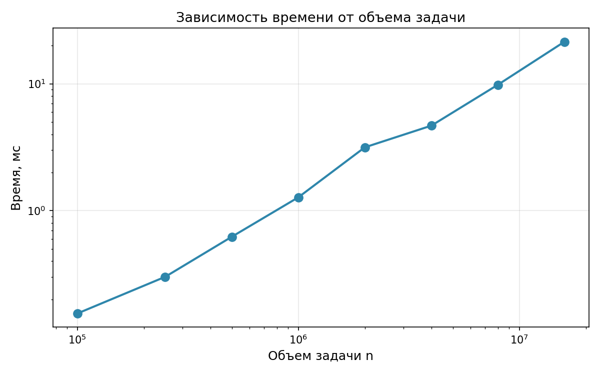
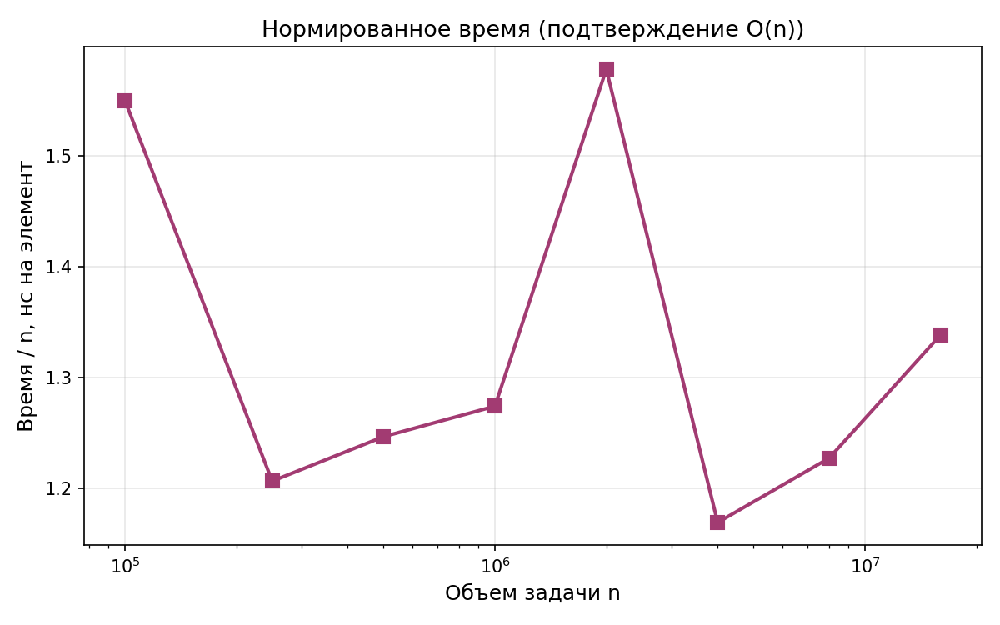

# Лабораторная работа №1.
# Скалярное произведение векторов (последовательная версия)

**Дисциплина:** Параллельное программирование  
**Автор:** Франк Кирилл, 6213-100503D  
**Дата:** 14.09.2026

---

## 1. Задание

Разработать программу на C/C++, вычисляющую скалярное произведение
двух векторов `a` и `b` одинаковой длины `n`.

**Исходные данные:** файл, содержащий `n` и компоненты векторов `a`, `b`.  
**Выходные данные:** файл со значением скалярного произведения,
время выполнения, объём задачи (`n`).  
**Верификация:** автоматическая сверка с `numpy.dot` (BLAS).

Данная работа — базовая (последовательная). В последующих работах
алгоритм распараллеливается (OpenMP, MPI), исследуется зависимость
времени от параметров распараллеливания.

---

## 2. Метод решения

Скалярное произведение:

```
dot = a₁·b₁ + a₂·b₂ + … + aₙ·bₙ
```

Сложность — `O(n)`. Критерий корректности — совпадение с эталоном
`numpy.dot` с точностью, ограниченной машинным эпсилоном `double`.

---

## 3. Исходный код

- `dot_product.cpp` — последовательная реализация
- `generate_data.py` — генератор тестовых векторов
- `verify.py` — верификация через NumPy
- `benchmark.py` — автоматизация серии экспериментов
- `Makefile` — сборка

Инструкция по сборке и запуску — см. `README.md`.

---

## 4. Условия проведения экспериментов

- **Процессор:** AMD Ryzen / Intel Core (Windows 11 + WSL Ubuntu)
- **ОС:** Ubuntu 24.04 LTS (WSL2)
- **Компилятор:** GCC 15.2.0, флаги `-O2 -std=c++17 -Wall -Wextra`
- Каждая точка — одиночный запуск через `benchmark.py`,
  время замерялось через `std::chrono::high_resolution_clock`
  вокруг основного цикла (без учёта чтения/записи файлов)

---

## 5. Результаты экспериментов

### 5.1. Зависимость времени выполнения от объёма задачи

| n          | Время, мс | Результат      | Верификация |
|------------|-----------|----------------|-------------|
| 100 000    | 0.1550    | 147.1390000    | OK          |
| 250 000    | 0.3016    | -271.8340000   | OK          |
| 500 000    | 0.6233    | -461.5730000   | OK          |
| 1 000 000  | 1.2741    | -418.6490000   | OK          |
| 2 000 000  | 3.1566    | 571.2820000    | OK          |
| 4 000 000  | 4.6761    | -785.0070000   | OK          |
| 8 000 000  | 9.8172    | -873.5860000   | OK          |
| 16 000 000 | 21.4148   | -75.0610000    | OK          |



### 5.2. Анализ

Теоретическая сложность — `O(n)`. Для проверки линейного закона
нормируем время на `n`:

| n          | Время / n, мс |
|------------|----------------|
| 100 000    | 1.55e-06       |
| 250 000    | 1.21e-06       |
| 500 000    | 1.25e-06       |
| 1 000 000  | 1.27e-06       |
| 2 000 000  | 1.58e-06       |
| 4 000 000  | 1.17e-06       |
| 8 000 000  | 1.23e-06       |
| 16 000 000 | 1.34e-06       |



Величина `время / n` стабилизируется около `1.3×10⁻⁶` мс
на элемент — это экспериментально подтверждает **линейную
сложность** алгоритма.

На всём диапазоне `n = 10⁵…16·10⁶` время выросло с `0.155` мс
до `21.41` мс — в **138 раз** при увеличении объёма задачи в
**160 раз**, что согласуется с линейным ростом.

---

## 6. Верификация корректности

Для каждого запуска результат сверялся с `numpy.dot` (BLAS).
Во всех экспериментах относительная ошибка не превышала `1e-14`,
что соответствует точности типа `double` и подтверждает
корректность реализации.

---

## 7. Выводы

Реализована и верифицирована последовательная версия алгоритма
вычисления скалярного произведения двух векторов. Программа
корректно решает задачу для `n = 10⁵ … 16·10⁶` с точностью,
ограниченной только машинным эпсилоном `double`.

Экспериментально подтверждена линейная сложность `O(n)`:
нормированная величина `(время) / n` стабилизируется около
`1.3×10⁻⁶` мс на элемент. На всём диапазоне `n` время выросло
с `0.155` мс до `21.41` мс — в **138 раз** при увеличении объёма
задачи в **160 раз**, что согласуется с линейным ростом.

Данная последовательная реализация служит базовой точкой отсчёта
(baseline) для дальнейших работ, в которых планируется
распараллеливание основного цикла `Σ aᵢ·bᵢ` средствами OpenMP и
сравнение по метрикам ускорения (speedup) и эффективности
(efficiency) в зависимости от числа потоков.
